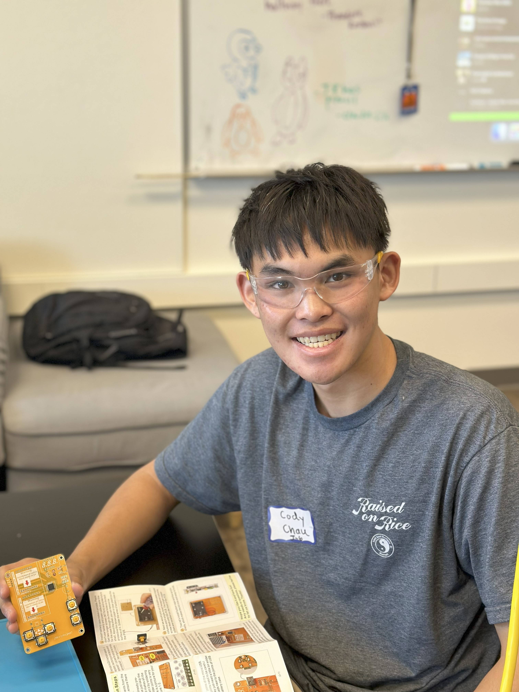
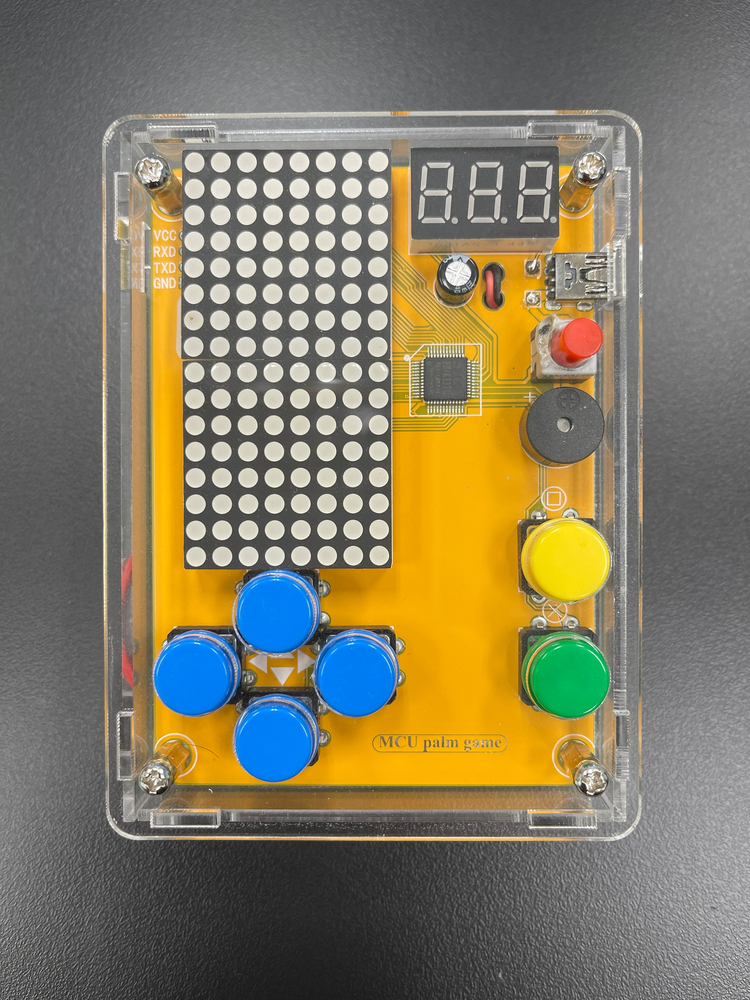

# Hexapod
The Hexapod is a six legged robot designed to mimic the walking of similar insects. It is controlled via a Freenove control board, an Arduino compatible board, that serves as the brain of the Hexapod, managing the individual three servos per leg, 18 servos total, to coincide with a designated motion to produce one overarching walking movement. It also consists of several high quality acrylic pieces attached to each component via a variety of screws and nuts, creating a very sturdy and durable figure. To control the robot, it can be connected to a computer program launched using the Processing App via USB cable, or connected wirelessly to a phone or custom remote control through a WLAN module (wireless module). So, the Hexapod serves as a simple but complex robot capable of great movement, while also leaving room for personal modifications.

| **Engineer** | **School** | **Area of Interest** | **Grade** |
|:--:|:--:|:--:|:--:|
| Cody C | Aliso Niguel High School | Mechanical Engineering | Incoming Junior

<!---

# Final Milestone: Adding a Claw & Finalizing the Build

### Summary

For my final milestone, I built a robotic arm for the top of my Hexapod robot. This arm comes from the LK Cokoino Robotic Arm Kit, and comes with an arduino nano-style MCU board, a servo driver shield, three MG90S micro servos, one SG90 servo, two joystick modules, many acrlyic peices, and a variety of screws, nuts, and spacers for assembly. However, I did not have the required batteries for the given battery case. So instead, I soldered on a new battery case compatible with the AA batteries we did have in stock. Then, after assembling and programming the rest of the Cokoino arm, I began the process of integrating the arm ontop of the Hexapod. By drilling the adjacent holes in vacant places on both the top acrylic piece of the Hexapod and the acrylic baseplate of the Cokino arm, I used spare brass standoffs to attach the arm. However, the Hexapod was now unevenly weighted due to loading the arm more towards the front of the Hexapod to maximize the arm's range of motion. So, I decided to design and 3D print a battery case holder for both the Cokoino arm battery case and the Hexapod battery pack for the back of the Hexapod in Solidworks. Now, not only was the Hexapod balanced, but the batteries were no longer detached from the build. Finally, I decided to make the Cokoino arm wirelessly controlled from my phone by installing a HM-10 module onto the arduino nano and updating the code. 

### Challenges

Adding the many modifications to my Hexapod proved to be a much more complicated and laborous task than I had previously imagined. To start, I experienced many difficulties with the base code of the Cokoino arm. These problems included the arm jerking up and down when moving downwards, performing two actions simultaneously with one input, and a really irritating additional feature where the Cokoino would buzz and reset to a default position after moving the right joystick right. So, i had to rewrite most of the code to smoothen out the movements of the arm, make each joystick input independent of one another, removing the additional feature, and adding new code to the left and right inputs of the right joystick to coincide with opening and closing the claw respectively. Secondly, durnig the integration of my two builds, one of the drill holes on the Cokoino arm baseplate was misaligned, meaning only three screws could slot into there designed places. To solve this issue, I hand filed the hole until it was alligned with the brass standoff, which added unnecessary time to the integration process. And when I recieved the 3D print for my battery holder, the dimensions for screw holes were misaligned as well. So, I hand to file down both the holes on the Cokoino arm baseplate and the 3D print, the edge of the base plate, the backside of the battery pack, and the surrounding sides of one of the screw holes so they would all fit. I also had to file down the battery case hole for the Cokoino arm battery case so it would slide in. Filing down the 3D print took an entire day, which was unexpected, annoying, and extremely exhausting and could've been avoided had I taken more care with measureing the dimensions for my battery pack holder. 

-->

# Third Milestone: Building the Remote Control

<iframe width="560" height="315" src="https://www.youtube.com/embed/7WlOX7pwp6g?si=nfwdGRvKDJGPHQcO" title="YouTube video player" frameborder="0" allow="accelerometer; autoplay; clipboard-write; encrypted-media; gyroscope; picture-in-picture; web-share" referrerpolicy="strict-origin-when-cross-origin" allowfullscreen></iframe>

### Summary

For my third milestone, I built the remote control for the Hexapod and connected it to the robot. This milestone includes M2.5*8 screws, M2.5*10 screws, M2.5 nuts, a Freenove control board, a Freenove smart car remote shield, a 9V battery holder, two wireless (RF) modules, and acrylic parts. So, after assembling each of these parts to form the remote control, I connected it to my computer via USB cable and uploaded the necessary code using the Arduino program, the same method I used to upload the code for the Hexapod control board. After doing so, the remote control's wireless module was able to connect to its identical module that I installed onto the Hexapod control board, allowing me to control its movement via remote control. The remote control itself consists of a three switchs, two dials (only one is used), and one joystick. The joystick serves as the main component controlling the Hexapod, moving the robot forward, backward, right, and left if the joystick is pushed in that respective direction. However, each switch activiates a different movement for the joystick; walking, shifting, and tiliting. Multiple switches can be turned on to perform different movements at the same time, allowing the Hexapod to walk and turn at the same time. The dial is used to control the overall height of the Hexapod, elevating its body after full leg extension, and laying its body on the floor after full leg retraction.

### Challenges

Connecting the remote control to the Hexapod proved more difficult than expected due inexplicit directions and complications with the code in Arduino, but because it was the same process as uploading the code into the Hexapod control board, I was able to solve the problem quicker than before. Besides this obstacle, building the remote control was relatively simple compared to the Hexapod and testing the remote was similar to the phone and computer testing, so I was familiar with all the Hexapod movement capabilites. So, I now plan to make all my modifications.  

# Second Milestone: Finalizing, Calibrating, & Testing

<iframe width="560" height="315" src="https://www.youtube.com/embed/zR7D7uRWW-0?si=V6vFQ0LXjdSA8Qxb" title="YouTube video player" frameborder="0" allow="accelerometer; autoplay; clipboard-write; encrypted-media; gyroscope; picture-in-picture; web-share" referrerpolicy="strict-origin-when-cross-origin" allowfullscreen></iframe>

### Summary

For my second milestone, I finalized the body of the Hexapod, calibrated each leg to their correct position, tested its movement, and connected it to my phone. This milestone only includes a 75cm cable tidy and a WLAN module because most of the work was confined to the online program used to calibrate and test the Hexapod known as the Processing App. So, after organizing all the cables using the cable tidy and installing the WLAN module into the control board, I connected the Hexapod to my computer via USB cable and began adjusting each leg to their respective point on the calibration graph shown below using the Processing App. After modifying each leg, I was then able to power on the Hexapod and test its movement using the controls tab provided in the program. It successfully turned left and right, moved forward and backward, shifted its body position, and tilted its body position. But the Hexapod can also be controlled with a phone. The WLAN module connected to the control board emits its own Wifi signal, creating its own network and allowing me to connect my phone to the robot via Wifi. Then after installing the Freenove App on my phone and clicking the Hexapod mode, I succeeded in performing the same movement functions wirelessly on my phone that I had previously tested using the Processing App on my computer.

From <a href="[https://chatgpt.com/](https://github.com/Freenove/Freenove_Hexapod_Robot_Kit/archive/master.zip)"> Freenove Hexapod </a> tutorial file

### Challenges

I did not face many challenges during this milestone, but calibrating each leg proved to be an arduous and strenuous task. There are six separate controls to adjust each leg's X, Y, and Z position, so individually clicking each button via mousepad was tiring and irritating. But with careful precision and much patience, each leg was correctly calibrated and performed perfectly when powered on and tested. So now, for my third milestone, I will build and connect the remote control for the Hexapod, which would fully complete the FREENOVE Hexapod Robot Kit.

# First Milestone: Assembling the Hexapod

<iframe width="560" height="315" src="https://www.youtube.com/embed/LN2Hm0sxPw8?si=aUJusJhmtEGo22LK" title="YouTube video player" frameborder="0" allow="accelerometer; autoplay; clipboard-write; encrypted-media; gyroscope; picture-in-picture; web-share" referrerpolicy="strict-origin-when-cross-origin" allowfullscreen></iframe>

### Summary

For my first milestone, I assembled the body and legs of my Hexapod, which is a six legged robot controlled by a central Arduino board. This milestone includes the Freenove Crawling Robot Controller (Arduino compatible board), a USB cable (to input code), 8 servo packages (a servo motor, servo mount, and screws), M1.2*7 self-tapping screws, M2*10 screws, M2 nuts, M3*12 screws, M3 nuts, M3*8 screws, M3*5 brass standoffs, M3*27 brass standoffs, and several acrylic pieces. Each leg of the Hexapod contains three servos; two servos for the connection between the main body and the femur, forming the coxa of the leg (first section of the leg), and one for the connection between the femur and tibia (second and third part of the leg respectively). After assembling each individual part of the leg (servos, servo mounts, screws and nuts, and acrylic pieces) and coding and building the main body, I began attaching each part together utilizing the variety of provided screws and nuts. Then, with each servo meticulously connected to the control board, it can be powered on. The servos will then rotate to a fixed orientation to closely resemble the starting position of the finalized robot.

### Challenges

Over the course of this first milestone, I encountered many struggles. My first challenge was inputting the code into the Arduino board. Since this was my first time using Arduino, I ran into many roadblocks, such as failing to upload the files for the code into the Arduino program and even the code itself into the Freenove control board. But after several troubleshooting efforts and the aid of online documentations, I succeeded in inputting the code into the control board. Secondly, the sheer amount of screws was very daunting and overwhelming, being very tedious and difficult to secure each screw into its correct position due to their small size and close proximity to other components. But through perseverance and many hand cramps, I fastened each one after much time and effort. Lastly, the total 18 servos each had their individual wire connected to the control board, so it was very difficult organizing and checking each servo. But because of my attention to detail and delicate care, all servos powered on correctly on my first attempt. So next, for my second milestone, I plan to calibrate each leg to its specific position and finally test the Hexapod's movement. 

# Starter Project: Retro Arcade Console

<iframe width="560" height="315" src="https://www.youtube.com/embed/MOtjQcMDxQQ?si=XrkvdSWTWXNjZnzv" title="YouTube video player" frameborder="0" allow="accelerometer; autoplay; clipboard-write; encrypted-media; gyroscope; picture-in-picture; web-share" referrerpolicy="strict-origin-when-cross-origin" allowfullscreen></iframe>

### Summary

For my starter project, I assembled a retro arcade console. Using a 2.8x3.8inch PCB as a base, I soldered on a 12 mm 5V passive buzzer, a 220uF 16V electric capacitor, a 4-pin 90 micro usb, a 8x8mm self-switch, a 3631AS digitron display, a STC8H3K64S2 IC chip, two 1088BS 8x8mm LED dot matrix modules, and a battery case to the PCB. Then, using a variety of colored caps and acrylic shells, I finalized my project. It functions by switching on the red power button and selecting the level at which to play using the left and right blue buttons. After then pressing the yellow button to confirm the level, it starts playing tetris. It plays a little tertris tune at the beginning and keeps score in the top right corner. Once finished, the power switch can be pushed again to turn it off.

### Challenges

During my assembly, I struggled soldering on specific pieces. For example, the two wires connecting the battery pack to the PCB are very small and in close proximity not only to each other, but to other parts as well. So, while soldering on the wires, my soldering iron accidently touched the power switch and melted one of its corners. It still functions, but if I had soldered any longer, it may have permantly damaged and shut down the power switch. So next time, when I begin soldering my intensive project, the Hexapod, I will be more mindful of not only my surroundings, but the surrounds of my soldering iron.

# Schematics 

From <a href="[https://chatgpt.com/](https://github.com/Freenove/Freenove_Hexapod_Robot_Kit/archive/master.zip)"> Freenove Hexapod </a> tutorial file

From LK Cokoino Robotic Arm tutorial file

<!---
# Final Milestone

<iframe width="560" height="315" src="https://www.youtube.com/embed/F7M7imOVGug" title="YouTube video player" frameborder="0" allow="accelerometer; autoplay; clipboard-write; encrypted-media; gyroscope; picture-in-picture; web-share" allowfullscreen></iframe>

For your final milestone, explain the outcome of your project. Key details to include are:
- What you've accomplished since your previous milestone
- What your biggest challenges and triumphs were at BSE
- A summary of key topics you learned about
- What you hope to learn in the future after everything you've learned at BSE

# Second Milestone

<iframe width="560" height="315" src="https://www.youtube.com/embed/y3VAmNlER5Y" title="YouTube video player" frameborder="0" allow="accelerometer; autoplay; clipboard-write; encrypted-media; gyroscope; picture-in-picture; web-share" allowfullscreen></iframe>

For your second milestone, explain what you've worked on since your previous milestone. You can highlight:
- Technical details of what you've accomplished and how they contribute to the final goal
- What has been surprising about the project so far
- Previous challenges you faced that you overcame
- What needs to be completed before your final milestone 

# First Milestone

<iframe width="560" height="315" src="https://www.youtube.com/embed/CaCazFBhYKs" title="YouTube video player" frameborder="0" allow="accelerometer; autoplay; clipboard-write; encrypted-media; gyroscope; picture-in-picture; web-share" allowfullscreen></iframe>

For your first milestone, describe what your project is and how you plan to build it. You can include:
- An explanation about the different components of your project and how they will all integrate together
- Technical progress you've made so far
- Challenges you're facing and solving in your future milestones
- What your plan is to complete your project

# Schematics 
Here's where you'll put images of your schematics. [Tinkercad](https://www.tinkercad.com/blog/official-guide-to-tinkercad-circuits) and [Fritzing](https://fritzing.org/learning/) are both great resoruces to create professional schematic diagrams, though BSE recommends Tinkercad becuase it can be done easily and for free in the browser. 

-->

# Code

### Hexapod Code:

<pre>#ifndef ARDUINO_AVR_MEGA2560
#error Wrong board. Please choose "Arduino/Genuino Mega or Mega 2560"
#endif

// Include FNHR (Freenove Hexapod Robot) library
#include <FNHR.h>

FNHR robot;

void setup() {
  // Start Freenove Hexapod Robot with default function
  robot.Start(true);
}

void loop() {
  // Update Freenove Hexapod Robot
  robot.Update();
} </pre>

### Hexapod Remote Code:
  
<pre>#ifndef ARDUINO_AVR_UNO
#error Wrong board. Please choose "Arduino/Genuino Uno"
#endif

// Include FNHR (Freenove Hexapod Robot) library
#include <FNHR.h>

FNHRRemote remote;

void setup() {
  // Start remote
  remote.Start();
}

void loop() {
  // Update remote
  remote.Update();
} </pre>

### LK Cokoino Arm Code:

<pre>#include "src/CokoinoArm.h"
#include <SoftwareSerial.h>

#define buzzerPin 9

SoftwareSerial BTSerial(10, 11); // RX, TX
CokoinoArm arm;

int xL, yL, xR, yR;
int xL_center = 512, yL_center = 512;
int xR_center = 512, yR_center = 512;
int deadZone = 30;

int currentAngle1 = 90;
int currentAngle2 = 90;
int currentAngle3 = 90;
int currentAngle4 = 90;

void turnUD() {
  int deviation = xL - xL_center;
  if (abs(deviation) > deadZone) {
    int delta = (deviation < 0)
      ? map(abs(deviation), deadZone, xL_center, 1, 5)
      : -map(abs(deviation), deadZone, 1023 - xL_center, 1, 5);
    currentAngle2 = constrain(currentAngle2 + delta, 0, 180);
    arm.servo2.write(currentAngle2);
    delay(15);
  }
}

void turnLR() {
  int deviation = yL - yL_center;
  if (abs(deviation) > deadZone) {
    int delta = (deviation < 0)
      ? -map(abs(deviation), deadZone, yL_center, 1, 5)
      : map(abs(deviation), deadZone, 1023 - yL_center, 1, 5);
    currentAngle1 = constrain(currentAngle1 + delta, 0, 180);
    arm.servo1.write(currentAngle1);
    delay(15);
  }
}

void controlServo3WithRightStick() {
  if (xR < 500 || xR > 524) {
    int delta = (xR < 512)
      ? -map(xR, 0, 512, 5, 1)
      : map(xR, 512, 1023, 1, 5);
    currentAngle3 = constrain(currentAngle3 + delta, 0, 180);
    arm.servo3.write(currentAngle3);
    delay(15);
  }
}

void controlClawWithRightY() {
  if (yR < 500 || yR > 524) {
    int delta = (yR < 512)
      ? -map(yR, 0, 512, 5, 1)
      : map(yR, 512, 1023, 1, 5);
    currentAngle4 = constrain(currentAngle4 + delta, 0, 180);
    arm.servo4.write(currentAngle4);
    delay(15);
  }
}

void handleBluetoothCommand(char cmd) {
  switch (cmd) {
    case 'L': arm.left(10); break;
    case 'R': arm.right(10); break;
    case 'U': arm.up(10); break;
    case 'D': arm.down(10); break;
    case 'O': arm.open(10); break;
    case 'C': arm.close(10); break;
    default:
      Serial.print("Unknown command: ");
      Serial.println(cmd);
      break;
  }
}

void setup() {
  Serial.begin(9600);
  BTSerial.begin(9600);

  arm.ServoAttach(4, 5, 6, 7);
  arm.JoyStickAttach(A0, A1, A2, A3);
  delay(1000);

  xL_center = arm.JoyStickL.read_x();
  yL_center = arm.JoyStickL.read_y();
  xR_center = arm.JoyStickR.read_x();
  yR_center = arm.JoyStickR.read_y();
}

void loop() {
  xL = constrain(arm.JoyStickL.read_x(), 0, 1023);
  yL = constrain(arm.JoyStickL.read_y(), 0, 1023);
  xR = constrain(arm.JoyStickR.read_x(), 0, 1023);
  yR = constrain(arm.JoyStickR.read_y(), 0, 1023);

  Serial.print("xL: "); Serial.print(xL);
  Serial.print(" yL: "); Serial.print(yL);
  Serial.print(" xR: "); Serial.print(xR);
  Serial.print(" yR: "); Serial.println(yR);

  if (abs(xL - xL_center) > deadZone) turnUD();
  if (abs(yL - yL_center) > deadZone) turnLR();
  if (abs(xR - xR_center) > deadZone) controlServo3WithRightStick();
  if (abs(yR - yR_center) > deadZone) controlClawWithRightY();

  if (BTSerial.available()) {
    handleBluetoothCommand(BTSerial.read());
  }
} </pre>

If you see this it means the page is up to date fr fr

# Bill of Materials

| **Part** | **Note** | **Price** | **Link** |
|:--:|:--:|:--:|:--:|
| FREENOVE Hexapod Robot Kit | contains Hexapod components | $126.95 | <a href="https://www.amazon.com/Freenove-Raspberry-Crawling-Detailed-Tutorial/dp/B07FLVZ2DN?source=ps-sl-shoppingads-lpcontext&ref_=fplfs&smid=AV3WCPW70PEXC&th=1"> Amazon Link </a> |
| LK Cokoino Robot Arm Kit | contains LK Cokoino Arm components | $126.95 | <a href="[https://www.amazon.com/Freenove-Raspberry-Crawling-Detailed-Tutorial/dp/B07FLVZ2DN?source=ps-sl-shoppingads-lpcontext&ref_=fplfs&smid=AV3WCPW70PEXC&th=1](https://www.amazon.com/LK-COKOINO-Compliment-Engineering-Technology/dp/B081FG1JQ1)"> Amazon Link </a> |

# Resources Used

- <a href="https://chatgpt.com/"> chatgpt.com </a>
- <a href="https://www.google.com/"> google.com </a>
- <a href="https://forum.arduino.cc/?utm_source=google&utm_medium=cpc&utm_campaign=US-Pmax&gad_source=1&gad_campaignid=22096018017&gbraid=0AAAAACbEa87kkIPAge4oJDHhq5mou8kNd&gclid=CjwKCAjw7MLDBhAuEiwAIeXGIUnnXopqW49c_WzxMeU598L7HnDryC3cIj5LD9C1Jiv0ZrMBpG4WZRoCyqAQAvD_BwE
"> forum.arduino.cc </a>
- <a href="https://www.youtube.com/watch?v=nivTZeGthf4"> YT Freenove Hexapod tutorial </a>
